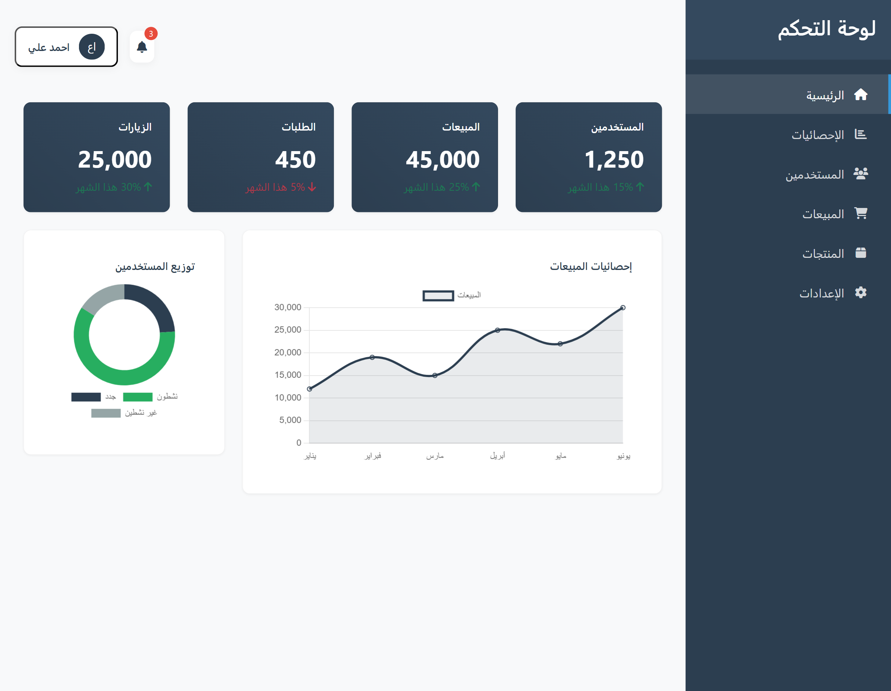
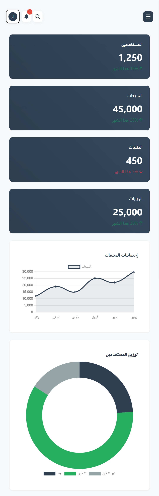
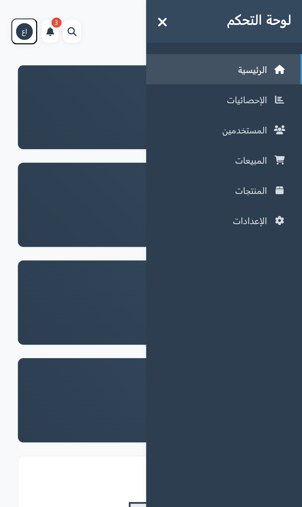

# Modern Admin Dashboard

  
  
  
  
  

A modern and responsive admin dashboard built with Bootstrap 5, featuring an intuitive interface for managing administrative tasks efficiently.

  
  

## Overview
This admin dashboard provides a comprehensive interface for managing various administrative tasks. It features a responsive design that works seamlessly across desktop and mobile devices.

## Project Timeline

**Initial Release:** `May 23, 2023`
- Basic dashboard structure implementation
- Core UI components development
- Essential features integration

**First Major Update:** `December 2024`
- Enhanced mobile responsiveness
- Interactive dashboard elements
- Performance optimizations
- User experience improvements

**Latest Update:** `July 2025`
- UI/UX refinements
- Cross-browser compatibility fixes
- Performance enhancements
- Bug fixes and stability improvements

## Screenshots

### Desktop Interface

  

### Mobile Experience

  

    
    
<em>Home Screen</em>

  

  

    
    
<em>Statistics View</em>

  

## Features
- Responsive layout (Desktop & Mobile)
- Bootstrap 5 framework
- Modern UI/UX design
- Interactive dashboard elements
- Cross-browser compatibility

## Technical Stack
- HTML5
- CSS3
- Bootstrap 5
- JavaScript
- Font Awesome Icons

## Browser Support
- Chrome (latest)
- Firefox (latest)
- Safari (latest)
- Edge (latest)
- Opera (latest)

## License
This project is licensed under the MIT License - see the LICENSE file for details.

## Contributing
Contributions are welcome! Please feel free to submit a Pull Request.
